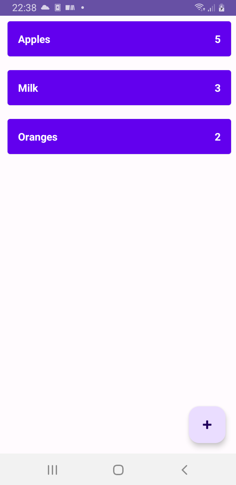
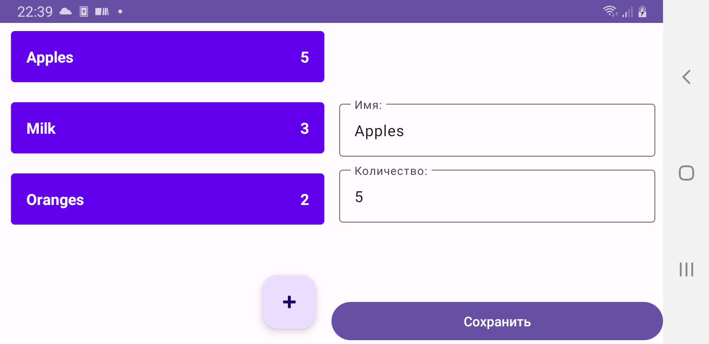
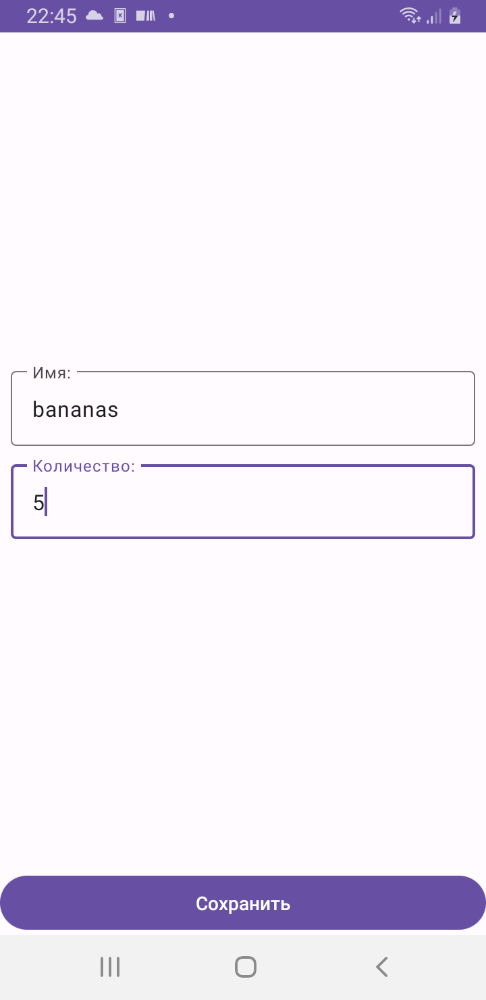
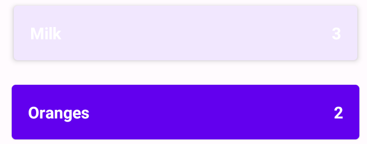

ShoppingList
=

Приложение, которое представляет из себя список продуктов, которых нужно купить. Можно добавить, отметить, что куплено, отредактировать. Также поддерживается вертикальная ориентация.

Стек: Room, Dagger, Coroutines, MVVM, Clean Architecture, (Content Provider).

Внешность
--
|Главный экран (portrait)| Главный экран (landscape) и добавление | Добавление (portrait) | Возможность изменить состояние элемента |
|-|-|-|-|
|||||
